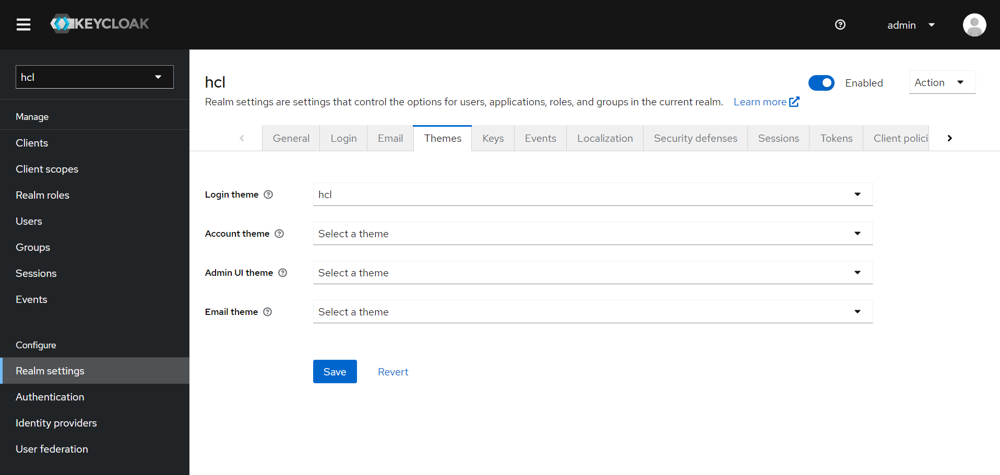

# Custom Themes

Keycloak provides theme support for web pages and emails. This allows customizing the look and feel of end-user facing pages so they can be integrated with your applications.

## Theme types

A theme can provide one or more types to customize different aspects of Keycloak. The types available are:

- Account - Account management
- Admin - Admin Console
- Email - Emails
- Login - Login forms
- Welcome - Welcome page

## Configuring a theme

All theme types, except welcome, are configured through the Admin Console.

### Procedure

- Log into the Admin Console.

- Select your realm from the drop-down box in the top left corner.

- Click Realm Settings from the menu.

- Click the Themes tab.

  - To set the theme for the master Admin Console you need to set the Admin Console theme for the master realm.
  - To see the changes to the Admin Console refresh the page.

- Change the welcome theme by using the spi-theme-welcome-theme option.

- For example:

  - bin/kc.[sh|bat] start --spi-theme-welcome-theme=custom-theme

  

For more customizations on theme, please refer below links-

- Default themes - <https://www.keycloak.org/docs/latest/server_development/#_default-themes>
- Creating a theme - <https://www.keycloak.org/docs/latest/server_development/#creating-a-theme>
- Deploying themes - <https://www.keycloak.org/docs/latest/server_development/#deploying-themes>
- Additional resources for Themes - <https://www.keycloak.org/docs/latest/server_development/#additional-resources-for-themes>
- Theme resources - <https://www.keycloak.org/docs/latest/server_development/#_theme_resource>
- Locale selector - <https://www.keycloak.org/docs/latest/server_development/#_locale_selector>
- Additional resources for Locale selector - <https://www.keycloak.org/docs/latest/server_development/#additional-resources-for-locale-selector>

