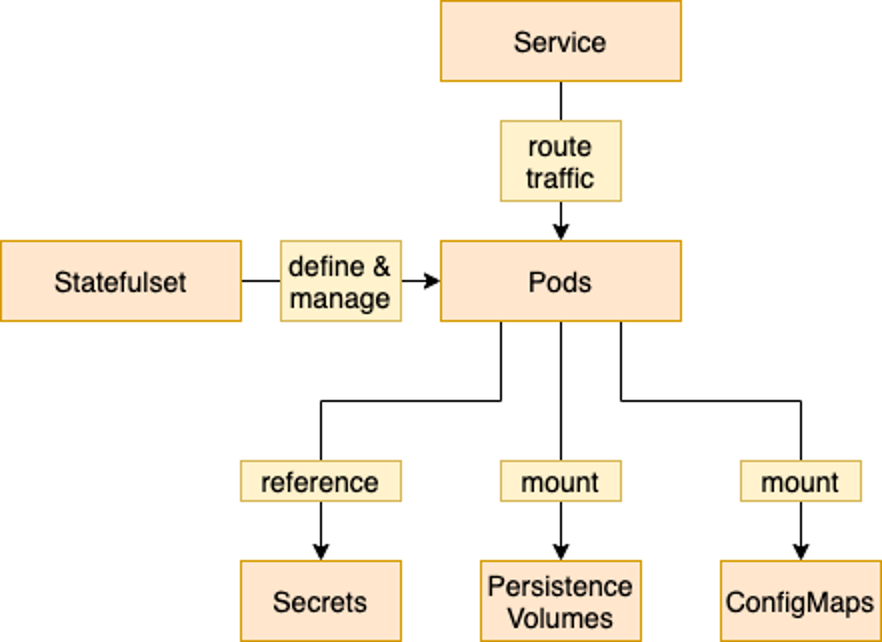

# Deploy the HCL Digital Solutions Keycloak service through Helm charts

The HCL Digital Solutions Keycloak chart heavily founds on Bitnami's charts. Bitnami charts for Helm are carefully engineered, actively maintained and are the quickest and easiest way to deploy containers on a Kubernetes cluster that are ready to handle production workloads.

This chart bootstraps a [Keycloak](https://www.keycloak.org/) deployment on a [Kubernetes](https://kubernetes.io) cluster using the [Helm](https://helm.sh) package manager.

## Helm overview

Helm is a software package manager that simplifies deployment of applications and services to Kubernetes container platform.

Helm is a tool for managing Kubernetes applications and deployments. It allows for packaging all required resource definitions into a single package, called a Helm Chart. The Helm Charts provide a convenient way to define application deployments with a predefined set of configurable items. Furthermore, Helm Charts are written using declarative definitions, applying yaml structures and go templates. This approach provides administrators with transparency about the operations the Helm Chart is performing during the HCL Digital Solutions (DS) Keycloak service container deployment.

## Helm chart contents

The HCL DS Keycloak service Helm Chart (Helm Chart name: hclds-keycloak) follows the standard Helm structures and guidelines.

```text
hclds-keycloak/
  templates/            # The directory containing all Helm templates for e.g. Kubernetes resources
  charts/               # The directory containg all Helm chart dependencies
  README.md             # README with information on Helm Chart usage and references to further documentation
  values.yaml           # Default chart configuration values
  Chart.yaml            # The Chart yaml file containing chart specific information
```

- **templates:** The templates directory contains all resource definitions, for example, Services, Statefulsets, Pods, etc.

- **values.yaml**: The values.yaml contains all default values for a deployment. It is possible to customize the deployment overwriting the default values of the values.yaml.

## Helm deployment flow


As outlined in the flow chart, when performing an install (or upgrade), the Helm Chart reads the values.yaml (and any overridden values, either provided through Helm CLI parameters or additional values files) and perform a schema validation check. After the schema check is successfully performed, Helm runs the templating engine to create the Kubernetes resource definitions out of the templates inside the Helm Charts.

As a last step, Helm accesses the Kubernetes Cluster and create the resulting Kubernetes resources in the desired namespace.

## Deployment structure

### Basics per application structure

Each deployed application follows a similar deployment structure, using a common set of Kubernetes resources that follow naming conventions.



The Keycloak service is managed by a StatefulSet, which controls the creation and life cycle of all pods it is responsible for. These Pods use Persistent Volumes for storing their application data, ConfigMaps to adjust application configuration, and Secrets to obtain access credentials.

In front of all Pods is a Service which manages routing the traffic to the Pods. This Service is also called by Ingress to fulfill incoming requests from outside the Kubernetes cluster.


## Prerequisites

- Kubernetes 1.19+
- Helm 3.2.0+

## Using the Helm chart

Check the following sections for using this Helm chart to manage your Kubernetes deployment.

- [Installation](./install.md) for deploying the service.
- [Configuration Parameters](./configuration-properties.md) for an overview of available parameters to configure the service.
- [Additional configuration and installation details](./additional-configuration-details.md) for more advanced or specific configuration details and tasks.
- [Uninstall](./uninstall.md) for instruction on cleaning up your environment after deploying the service.
- [Troubleshooting](./troubleshooting.md) for guideance on verifying the health of your setup and general troubleshooting approaches and options.

## QuickStart guide by Bitnami

You can also refer to Bitnami's guide on [Adding User Authentication to Applications with a Scalable Keycloak Deployment on Kubernetes](https://docs.bitnami.com/tutorials/integrate-keycloak-authentication-kubernetes) for a quick overview and introduction to securing applications with Keycloak.
