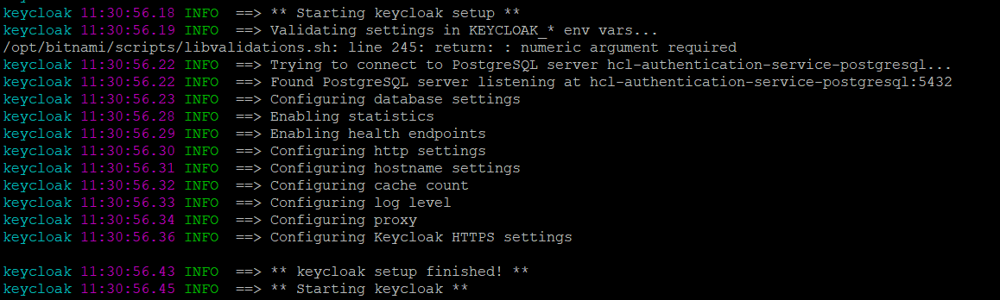
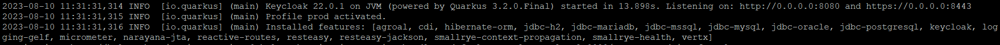
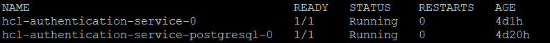

# Troubleshooting

## To check service is running and healthy refer

- [Verify your Keycloak instance is running and healthy](./install.md#verify-your-keycloak-instance-is-running-and-healthy)
- [Verify your Keycloak deployment](./install.md#verify-your-keycloak-deployment)

## Keycloak logging configuration

- Keycloak provides logging mechanisms that can be configured to capture relevant logs for troubleshooting.
- Enabling trace-level logging and health checks can help diagnose and resolve issues.
- Log level and output format can be modified in values.yaml at follwoing configuration or can be provided in hclds-keycloak-values.yaml as mentioned in [Install section](./install.md#prepare-a-yaml-file-to-provide-appropriate-config-during-deploy)

```yaml
## Keycloak logging configuration
## ref: https://www.keycloak.org/server/logging
## @param logging.output Alternates between the default plain unstructured log output format or json format
## @param logging.level Allowed values as documented: FATAL, ERROR, WARN, INFO, DEBUG, TRACE, ALL, OFF
##
logging:
  output: default
  level: INFO
```

- For more details refer following keycloak official documentation
  - <https://www.keycloak.org/server/logging>
  - <https://www.keycloak.org/server/health>

## Checking container logs

To check logs of the pod use kubectl command

```sh
# kubectl logs <pod-name> -n <namespace>
kubectl logs keycloak-0 -n hclds
```

Logs after pod started successfully looks something like this



## Check Pod Status

Verify the status of the Keycloak pods using kubectl command

```sh
# kubectl get pods -n <namespace>
kubectl get pods -n hclds
```

Pods should be in `Running` status.


Look for pods that are in a `Pending`, `CrashLoopBackOff`, or `Error` state and check the logs for any errors

## Troubleshooting Kubernetes Pod Status

### Issue: Pod Stuck in `Pending` State

Possible Causes:

- Insufficient resources (CPU, memory).
- Node resource constraints.
- Pod scheduling constraints.

Troubleshooting Steps:

1. Run `kubectl describe pod <pod-name> -n <namespace>` to get detailed information about the pod's status, conditions, and events.
2. Check if the pod has requested resources in its YAML. Adjust resource requests/limits if needed.
3. Check if any taints or node affinity rules are preventing pod scheduling.
4. Verify if the node where the pod is scheduled has enough available resources.

### Issue: Pod in `CrashLoopBackOff` State

Possible Causes:

- Application crashes or fails to start properly.
- Misconfigured command or entrypoint.
- Missing dependencies.

Troubleshooting Steps:

1. Check pod logs using `kubectl logs <pod-name> -n <namespace>` to see the logs of the crashing container.
2. Look for errors or exceptions in the logs indicating why the application is crashing.
3. Check if environment variables, configuration files, or secrets are properly mounted.
4. Ensure that the Docker image specified in the pod's YAML file is accessible and properly configured.

### Issue: Pod in `Error` State

Possible Causes:

- Application inside the pod encounters an error.
- Initialization failure.

Troubleshooting Steps:

1. Check pod logs using `kubectl logs <pod-name> -n <namespace>` to identify the error message.
2. Investigate the error message to determine the root cause.
3. If there is an initialization error, check if the application's startup script or commands are configured correctly.

### Issue: Pod is Restarting Frequently

Possible Causes:

- Application crashes repeatedly.
- Incorrect application configurations.
- Continuous resource usage.

Troubleshooting Steps:

1. Examine pod logs (`kubectl logs <pod-name> -n <namespace>`) to identify the reason for frequent restarts.
2. Look for patterns in the logs that indicate why the application is crashing.
3. Review application configuration and ensure it's properly aligned with the environment.
4. Monitor CPU and memory usage to see if the application consumes excessive resources.

### Issue: Pod Status is `ImagePullBackOff`

Possible Causes:

- Image name or tag is incorrect.
- Authentication required to pull the image.

Troubleshooting Steps:

1. Run `kubectl describe pod <pod-name> -n <namespace>` to view more information about the image pull error.
2. Check if the image name and tag in the pod's YAML file are correct.
3. Verify that the image repository is accessible.
4. If authentication is required, make sure proper credentials are available as Kubernetes secrets.

By carefully examining the pod's status, logs, and related configuration, you can diagnose the root cause and apply the appropriate solution.

## Configuration Checks

Check that the ConfigMap and Secrets used to configure Keycloak contain accurate and valid information, including database credentials, URLs, and other settings.

## Service Checks

Ensure that Keycloak service(s) are running and accessible. Use `kubectl get svc -n <namespce>` to list services and their corresponding ClusterIP or NodePort. Verify that the services are assigned proper IPs and ports.

## Database Connectivity

Verify that Keycloak is able to connect to the configured database. Incorrect database credentials or connectivity issues can cause failures.

## Ingress and Network

- **Ingress:** check the Ingress resource and make sure it is correctly configured to route traffic to the Keycloak service.
- **Network Policies:** Check if Network Policies are affecting the connectivity between Keycloak pods and other resources.

## Resource Consumption

Check if the Keycloak pods are consuming excessive resources (CPU, memory). Adjust resource limits if necessary.

## Helm Chart Specific Issues

Review the Helm values being used. Incorrect or missing values can lead to misconfigurations.

## Upgrades and Versions

Check if the Keycloak version is compatible with the Kubernetes environment and other components.

## Community and Documentation

- **Online Communities:** Reach out to the Keycloak community, forums, or mailing lists for assistance if you're unable to resolve the issue yourself.

- **Documentation:** Refer to Keycloak's official documentation for troubleshooting guides, known issues, and best practices.
