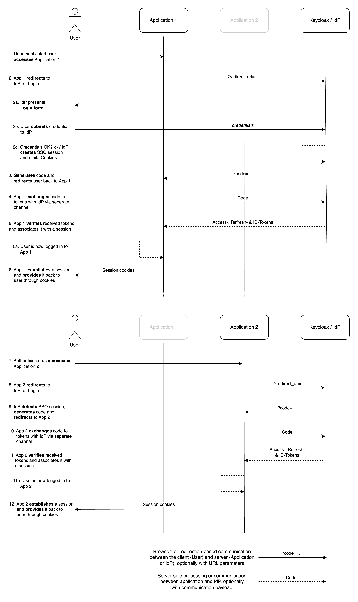

# OpenID Connect

Increasing numbers of enterprises use identity providers (IdPs) to manage the identities, access rights, and authentication flows of their customers, employees, and partners in their applications and IT landscape. Common IdP solutions and services include Microsoft Azure Active Directory, Okta, Auth0, and Keycloak. Each solution has unique approaches and capabilities that might make them a good choice, but all focus on common and standardized authentication strategies, most notably OIDC.

OpenID Connect (OIDC) is a modern authentication and authorization protocol that enhances digital security and user experience, particularly in the realm of identity and access management (IAM). Operating as an extension of the OAuth 2.0 framework, OIDC combines the strengths of OAuth's access delegation capabilities with identity verification, resulting in a comprehensive solution.

At its core, OIDC streamlines the process of confirming users’ identities and authorizing their access to digital resources. It achieves this process by establishing a trust relationship between the identity provider and the relying party (a web application or service, such as HCL Digital Experience). Users initiate the process by presenting their credentials to the IdP, which validates their identity. Then, the IdP issues tokens, including the ID token, which acts as proof of authentication, and the access token, which grants access to protected resources. OIDC enables supporting capabilities like Single Sign-On (SSO) on multiple applications, prolonged and uninterrupted user sessions, and collaboration among organizations while maintaining a secure identity exchange with granular control over data sharing. The protocol's flexibility accommodates diverse use cases, from mobile applications to single-page web apps. HCL Digital Solutions (DS) products recognize the benefits of and requirements for OIDC and support it.

## Related information

There are many resources regarding the benefits and inner workings of OIDC. Some noteworthy resources that we can recommend to get familiar with it can be found below.

- [What is OpenID Connect | openid.net](https://openid.net/developers/how-connect-works/)
- [OpenID Connect explained | connect2id.com](https://connect2id.com/learn/openid-connect)
- [What is OpenID Connect (OIDC) | auth0.com](https://auth0.com/intro-to-iam/what-is-openid-connect-oidc)
- [OpenID Connect concepts and terms | akamai.com](https://techdocs.akamai.com/eaa/docs/openid-connect-concepts-terms)
- [Choosing the right flow | openiddict.com](https://documentation.openiddict.com/guides/choosing-the-right-flow)

## General OIDC redirection-based SSO flow

The following flow diagram outlines a typical OIDC flow between a client through a web browser, a web application, and an identity provider. The so called authorization code flow presents a scenario that yields the best results. It first outlines the communication from a first entry point without authentication and continues with the access of a secondary web application by reusing the established session.

> **_Note:_**
>
> The authorization code flow requires a user-agent that supports redirection from the authorization server (IdP) to the application. Thus, it does not have to be a web browser but can be a desktop or mobile application.

### Other OIDC flows

Besides the Authorization code flow, OIDC (and the underlying OAuth2.0 specification) support additional flows. Most of them are there to address specific challenges or incompatibilities that existing (or legacy) applications may have when it comes to the above flow. HCL DS products have some caveats in that regard as well, which are outlined in the following section about [OIDC specifics for HCL DS products](#oidc-specifics-for-hcl-ds-products).

The following list provides an overview of the existing flow types. Click the links to learn more about the types.

- [Authorization code flow](https://learn.microsoft.com/en-us/azure/active-directory/develop/v2-oauth2-auth-code-flow): This flow is outlined earlier and typically the flow that provides the best results because it prevents the user-agent from obtaining or potentially exploiting the tokens while establishing the session.
- [Client credentials flow](https://learn.microsoft.com/en-us/azure/active-directory/develop/v2-oauth2-client-creds-grant-flow): In this flow, the client itself requests access through its own credentials, in contrast to impersonating and executing requests on behalf of a user.
- [Device auhorization grant flow](https://learn.microsoft.com/en-us/azure/active-directory/develop/v2-oauth2-device-code): This flow is designed to enable signing in to input-constrained devices, such as Smart TVs or IoT devices, and uses a browser of another device as an intermediary to log in with.
- [On-Behalf-Of (OBO) flow](https://learn.microsoft.com/en-us/azure/active-directory/develop/v2-oauth2-on-behalf-of-flow): This flow delegates a user's identity to a secondary (downstream) client to gain access to resources.
- [Implicit grant flow](https://learn.microsoft.com/en-us/azure/active-directory/develop/v2-oauth2-implicit-grant-flow): This flow is similar to the authorization code flow. However, the access token is returned directly to the client. This approach relies on third-party cookies. Because ongoing efforts endeavor to [phase out third-party cookies from browsers](https://developer.chrome.com/en/docs/privacy-sandbox/third-party-cookie-phase-out/), this approach should not be considered.
- [Resource Owner Password Credentials](https://learn.microsoft.com/en-us/azure/active-directory/develop/v2-oauth-ropc): In this flow, the client handles the user credentials directly and relays them to the IdP in order to authenticate the user who generates the access tokens.

## OIDC specifics for HCL DS products

Typically, HCL DS products support OIDC and have well-defined and verified strategies. For specifics on the steps required to enable them for OIDC, refer to the sections about [Integrating HCL Digital Solutions products with an IdP](../../integration/ds-integration/).
HCL DS products follow the flow outlined [earlier](#general-oidc-redirection-based-sso-flow) closely. However,  you must keep in mind some specifics, which will be outlined in the following subsections.

### Session management

Individual products establish an internal session after the user’s identity is established through the identity provider. This identification of the user’s identity is not typically required. However, it helps to reduce the amount of communication and session-validation between the two instances and is the scenario that pertains to how products are configured and deployed in this documentation. In a WebSphere scenario (for example, CNX or DX), this means after successful authentication, the WebSphere server generates an `LtpaToken2` and connects it to the session. Subsequent requests are validated against the application-specific session first, and as long as this session remains valid, the server does not initiate additional validation challenges against the IdP. This also means, however, that the token and session time-outs have to match closely so that a timeout on the IdP side is not ignored on the application.

### User federation

The products and underlying runtimes typically rely on an in-place user federation to suffiently contextualize the user identity that the IdP provides. Usually, the IdP communicates some common and unique user attributes, such as their e-mail address, which the application server then maps to an actual user object, and which then is sent to the application. HCL DS products can also function without this additional user federation requirement. However, they do so to varying degrees. HCL DX, for example, uses the transient user capability and relies on a WebSphere custom login module to expand the user object, whereas CNX uses the Waltz utility and user profiles to populate its database to work with them. In both cases, additional challenges and considerations exist to keep in mind. The same applies for other HCL DS products.

### JWT token requirements

The underlying JWT tokens that are used to identify users and enable access might be different in HCL DS products. This difference means that the OIDC tokens might not be compatible and interchangeable, depending on the product. The differences also come primarily from the underlying application server and runtime programs. They are not driven by the application itself (WebSphere Application Server versus OpenLiberty versus Domino, for example). You might have to review each application to assess its requirements for communicated OIDC tokens. Different products likely require individual clients to be configured through the identity provider (IdP).

Configuring different client for different products is not an issue, but might allow you to use an existing OIDC authentication on HCL products. By using clients, the OIDC authentication is also reused but needs a round-trip to the IdP to be available to work with other applications to. This flow typically works well and has very little affect on the user experience (they might see a quick load and redirect before seeing application content). In some cases however, this flow can be more disruptive, for example, opening multiple links that trigger the OIDC flow might invalidate each other and lead to errors.

The [JWT tokens](./jwt-tokens.md) section provides more detail about the makeup of tokens and attributes to consider for HCL products.

### Authentication against product APIs

Challenges exist when you consider API based access and OIDC. HCL DS products typically support a variety of authentication methods in their APIs. All of them have their relevance and thus are in use by the product itself and by third party solutions that integrate with or extend the product. A common use case is, for example, to use basic authentication and send credentials in combination with a request so that the users gets authenticated as part of the request to access or manipulate a resource. This authentication scenario happens without the need for a browser or any type of user interaction, which are essential parts of the OIDC authentication flow as outlined [earlier](#general-oidc-redirection-based-sso-flow). To keep these methods functional, alternate OIDC flows like the Resource Owner Password Credentials flow can be used. However, this flow requires the application server to be enabled and appropriately configured for it. The second alternative is to have respective requests work around OIDC. However, this action might affect OIDC and [user federation](#user-federation).
