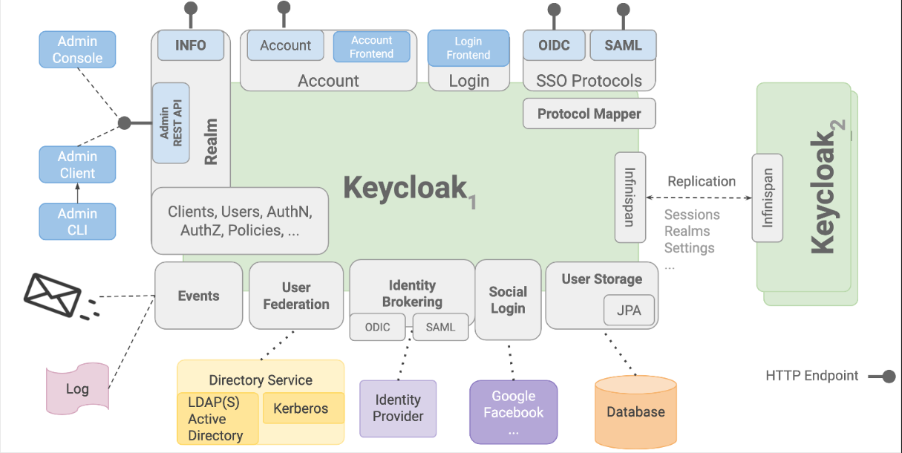

# Service overview

Keycloak is an OIDC based identity provider (or broker). It is the trusted party that orchestrates user authentication that relying parties such as HCL DS products can use. The deployment files and sources in this repository provide a Keycloak service that is adjusted to be more relevant and aligned with the HCL Digital Solutions products.

More generically, Keycloak is a high-performance, Java-based identity and access management solution. Developers use it to add an authentication layer to their applications with minimum effort.

[Overview of Keycloak](https://www.keycloak.org/)

The deployment code for Keycloak that is contained in this repository is based on Bitnami's Keycloak [image](https://hub.docker.com/r/bitnami/keycloak/) and [Helm chart](https://bitnami.com/stack/keycloak/helm). The service extends Keycloak with some initial configuration to help you start integrating this with HCL Digital Solutions (DS) products like Connections (CNX) and Digital Experience (DX).

## Keycloak service benefits

Many customers are moving toward using an identity provider (IdP) to manage the identities, authentication flows, and access rights of their users in their IT landscape. The HCL Digital Solutions products and their underlying runtime programs support common authentication protocols that IdPs use (most notably, OIDC), but do so to varying degrees.

Setting up and maintaining different HCL Digital Solutions products around those authentication requirements can be complex because of differing documentation, underlying application runtime programs, and capabilities and use cases. Cloud-native is one of HCL Software's primary focus areas, and HCL sees some challenges in this regard. Orchestrating a variety of products and connecting them to additional future services will increase the complexities and permutations and in turn the efforts on the customer side.

The HCL DS optimized Keycloak service aims to reduce complexities and efforts by providing a blueprint for such setups. The service shows how OIDC and a trusted IdP solution can help simplify the identity, authentication, and access management (IAM) aspects of our products and services. The service can show how competing requirements might relate to already established customer setups with similar solutions.

In the current version, the service focuses heavily on the authentication aspects and provides an outlook to identity management.

## Functions and benefits

Keycloak provides numerous functions and benefits that make it a great option to consider as an authentication solution. In the context of HCL DS products, the following are of particular value:

1. **Effortless Single Sign-on (SSO)**: Enjoy seamless access to multiple HCL and third-party products with a single login. No more repetitive logins; once you're in, you're in, and logging out from any product logs you out from all others.

2. **Robust Standards-Based Authorization**: Trust is established using industry-standard protocols like SAML 2.0, OIDC 1.0, or OAuth2.0, streamlining your authentication processes and user expectations.

3. **Token-Based Authentication**: Keycloak generates digitally signed and optionally encrypted tokens containing user and access information, aligning with OIDC standards. This ensures secure identity matching and facilitates various authentication aspects.

4. **Trust association**: Establish secure communication channels with HCL products through OIDC, emphasizing public key, digital signatures, and encryption. Ensure an effective strategy for configuring and refreshing trust relationships.

5. **Identity brokering**: Seamlessly bridge diverse identity providers and service providers. Establish trust with external identity providers, link or create accounts based on the obtained identity information, and support various protocols (e.g., OAuth, OIDC, SAML) used by common identity providers.

6. **User federation**: Connect to directory services such as LDAPs to facilitate user authentication, with or without synchronization.

7. **Unified User Experience**: Aggregate users from different sources while offering a consistent login experience. Customize details, branding, and properties in the tokens for differentiation.

8. **Backwards compatibility**: Easily integrate with existing HCL product authentication strategies without necessitating product-side changes.

9. **Multi-Factor Authentication (MFA)**: Enable MFA with support for various methods, including One Time Passwords (TOTP/HOTP), allowing both enforcement and optional use.

10. **Customizable UI**: Tailor the login interface to your preferences with customizable options. Benefit from default HCL branding or implement extensive customizations based on your specific product capabilities and customer needs.

11. **Streamlined deployment**: Simplify deployment with well-defined documentation and automate repetitive tasks to reduce manual intervention, errors, and deployment risks, making setup and configuration hassle-free.

You can see a full overview of its capabilities at [Keycloak features and concepts](https://www.keycloak.org/docs/latest/server_admin/index.html#features). Similarly, other IdPs match most (if not all) of these requirements as well, however they may have different takes or means of solving them.

While the content and documentation in this repository is focused on Keycloak as the reference implementation, we aim to keep it as generic as possible so that information, strategies and documentation can be applied as best as possible to other solutions and services as well.

### Keycloak - Architecture

The below image provides a good overview of the various components available within the Keycloak that touch many of the above functional requirements.

## What value does this provide?

The value we are aiming to provide is first and foremost a simplification of the configuration and maintenance of DS products w.r.t. authentication. As part of that, we want to confirm, harden and potentially improve the existing and established authentication strategies and documentation when using OIDC in our DS products.

We also strive to ease the setups of and improve the experience around the use of multiple DS products. This is seen in combination with our current cloud native strategy and multi application or multi service future we see within HCL Software.
