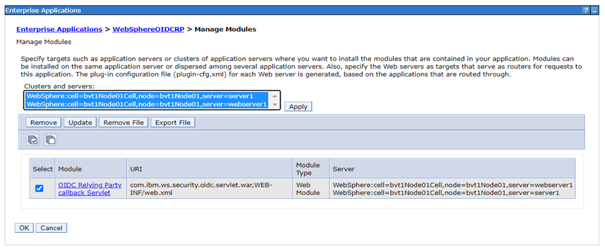

# Setting up OIDC for HCL Connections (CNX)

## Configuring OIDC Authentication for CNX

The following steps will configure your HCL Connections (CNX) installation to leverage OIDC based authentication with an OIDC compatible IdP, such as Keycloak. This means that CNX will be turned into an RP towards your IdP and leverage and trust it for authentication assertions.


### Overview of required configuration tasks

On a high level, the following tasks will be executed to establish this configuration:

- Install the OIDC RP TAI for WebSphere
- Configure the OIDC RP TAI against your IdP
- Update WAS security properties to match the new TAI requirements
- Add the server certificate to the WAS trust store to allow internal HTTPS communication
- Add external realm in federated repository
- Change role mappings in CNX applications
- Add redirection rules in IHS
- Update the LotusConnections-config
- Validate everything is working as expected


### What implications does this have?

Please be aware that configuring OIDC as the authentication protocol has certain implications to how features behave and have to be used or configured. Some of those implications are:

- Only users in the repository of the IdP can authenticate via OIDC. Users in other repositories, such as administrative users in the file registry, must bypass OIDC to authenticate.
- The outlined steps will still require the WebSphere server to have a federation to the same user directory set up in order to resolve users. There are ways to leverage underlying WAS capabilities to remove the dependency to a federation which have some caveats in their own right. This is subject to be elaborated on as part of this documentation in a later iteration.
- This procedure requires that the IdP and HCL CNX leverage the same user repository. There are ways to leverage underlying WAS capabilities to remove the dependency to a federation which have some caveats in their own right. This is subject to be elaborated on as part of this documentation in a later iteration.
- Unprotected or anonymous access is prevented through this configuration. A user needs to exist in order to access any CNX content and pages.


### Additional notes to keep in mind on the below tasks

Although these tasks will generally work, we are using references for how a configuration might look like in various places. In some cases, there are additional configuration options that alter the values to input or require steps to be conducted slightly differently. The following assumptions have been made:

- The login property to identify users is the `mail` attribute
- An IdP is set up and configured. Required details like the client id or secrets are available to configure during the below tasks.
- A Keycloak service (specifically, the HCL DS branded Keycloak version) is being used as the IdP (The OIDC layer will look mostly the same with any other IdP but can't be guaranteed due to the extensive landscape of providers)

- **Note** - As an additional note to the above point on the used HCL DS branded Keycloak service, there are a couple of steps that have to be conducted to set up the OIDC layer on the IdP side. This includes e.g. the setup of a realm, client, user federation and custom claims. The document [Configure Keycloak as an OIDC IdP for HCL Connections](./cnx-keycloak-configuration.md) provides details steps on setting up all necessary parts. If you are using a different IdP, this might still be relevant to confirm you are setting the OIDC layer up in a way that will work with DX.


## Installing the OIDCRP TAI

  - First, install the OIDC RP TAI. See more details here: [Configuring an OpenID Connect Relying Party](https://www.ibm.com/docs/en/was-nd/9.0.5?topic=users-configuring-openid-connect-relying-party).
  ```sh
  cd /opt/IBM/WebSphere/AppServer/bin
  wsadmin.sh -f installOIDCRP.py install bvt1Node01 server1

  ...
  ADMA5013I: Application WebSphereOIDCRP installed successfully.
  ```
  - Open the ISC and go to **Applications** -> **Application types** -> **Enterprise Applications** -> **WebsphereOIDCRP** -> **Manage modules**

  - Select available module and click “Apply” then “OK”.

    

## Configuring the OIDC RP TAI against your IdP

The following configuration will allow the OIDC RP TAI to contextualize which requests should be intercepted and how to treat them. In particular, this configuration is thightly connected to the Keycloak realm and client configuration.

The interceptor can be configured in the ISC under **Security** -> **Global Security** -> **Web and SIP security** -> **Trust association** -> **Interceptors**.

Click on the **New..** button to create a new interceptor with the **Interceptor class name** `com.ibm.ws.security.oidc.client.RelyingParty`.

**Note**: If the interceptor already exists, just click on it to access the configuration properties instead of creating it again.

Add the following custom properties:

| Name                                  | Value                                                                                   |
| ------------------------------------- | --------------------------------------------------------------------------------------- |
| provider_1.identifier                 | hcl                                                                                     |
| provider_1.clientId                   | hcl-cnx-oidc-client                                                                     |
| provider_1.clientSecret               | &lt;CLIENT_SECRET&gt;                                                                   |
| provider_1.authorizeEndpointUrl       | https://&lt;IDP_HOSTNAME&gt;/auth/realms/hcl/protocol/openid-connect/auth               |
| provider_1.tokenEndpointUrl           | https://&lt;IDP_HOSTNAME&gt;/auth/realms/hcl/protocol/openid-connect/token              |
| provider_1.interceptedPathFilter      | /activities/.\*,/blogs/.\*,/dogear/.\*,/files/.\*,/forums/.\*,/metrics/.\*,/metricssc/_,/mobile/.\*,/connections/filesync/.\*,/connections/filediff/.\*,/mobileAdmin/.\*,/storageproxy/.\*,/wikis/.\*,/connections/bookmarklet/.\*,/connections/oauth/.\*,/connections/resources/.\*,/connections/config/.\*,/communities/.\*,/connections/proxy/.\*,/help/.\*,/xcc/.\*,/selfservice/.\*,/news/.\*,/profiles/.\*,/search/.\*,/socialsidebar/.\*,/touchpoint/.\*,/connections/thumbnail/.\*,/connections/opengraph/.\*,/oauth2/.\*,/connections/opensocial/.\*,/push/.\*,/homepage/.\*,/moderation/.\*,/connections/rte/.\*,/connections/webeditors/.\*,/homepage/login/.\*,/profiles/oidc/session                                                                                                                           |
| provider_1.excludedPathFilter         | /activities/service/downloadExtended/.\*,/survey/.\*,/surveys/.\*,/ibm/console,/ibm/console/.\*,/profiles/dsx/.\*,/communities/dsx/.\*,/dm,/dm/atom/seedlist,/dm/atom/communities/feed,/activities/service/atom2/forms/communityEvent,/communities/recomm/handleEvent,/communities/calendar/handleEvent,/profiles/seedlist/myserver,/activities/service/atom2/forms/communityEvent,/news/web/statusUpdateEE.\*,/dogear/seedlist/myserver,/news/seedlist/myserver,/communities/calendar/seedlist/myserver,/activities/service/downloadExtended/.\*,/survey/.\*,/surveys/.\*,/ibm/console,/ibm/console/.\*,/profiles/dsx/.\*,/communities/dsx/.\*,/dm,/dm/atom/seedlist,/dm/atom/communities/feed,/activities/service/atom2/forms/communityEvent,/communities/recomm/handleEvent,/communities/calendar/handleEvent,/profiles/seedlist/myserver,/activities/service/atom2/forms/communityEvent,/news/web/statusUpdateEE.\*,/dogear/seedlist/myserver,/news/seedlist/myserver,/communities/calendar/seedlist/myserver,/mobile/homepage/SecurityConfiguration,/connections/resources/web/.\*,/connections/resources/ic/.\*,/connections/opensocial/rpc,/xcc/js/.\*,/xcc/templates/.\*,/files/static/.\*,/blogs/static/.\*,/wikis/static/.\*,/communities/calendar/Calendar.xml,/homepage/web/itemSetPersistence.action/repos,/files/wl/lifecycle/files,/wikis/wl/lifecycle/wikis,/forums/lifecycle/communityEvent,/blogs/roller-ui/BlogsWidgetEventHandler.do,/news/widget/communityHandler.do,/connections/opensocial/rest/people/.\*                                                                                                                                |
| provider_1.issuerIdentifier           | https://&lt;IDP_HOSTNAME&gt;/auth/realms/hcl                                            |
| provider_1.signatureAlgorithm         | RS256                                                                                   |
| provider_1.jwkEndpointUrl             | https://&lt;IDP_HOSTNAME&gt;/auth/realms/hcl/protocol/openid-connect/certs              |
| provider_1.userIdentifier             | email                                                                                   |
| provider_1.userDefaultIdentifierFirst | false                                                                                   |
| provider_1.scope                      | openid                                                                                  |
| provider_1.signVerifyAlias            | hcl-idp-cert                                                                            |
| provider_1.useJwtFromRequest          | IfPresent                                                                               |
| provider_1.createSession              | true                                                                                    |
| provider_1.verifyIssuerInIat          | true                                                                                    |
| provider_1.audiences                  | ALL_AUDIENCES                                                                           |
| provider_1.setLtpaCookie              | true                                                                                    |
| provider_1.callbackServletContext     | /oidcclient                                                                             |
| provider_1.mapIdentityToRegistryUser  | true                                                                                    |

- **Note** - Make sure to replace the `<IDP_HOSTNAME>` and `<CLIENT_SECRET>` placeholders with your respective details. The client secret is available through your IdP client configuration. Also ensure other properties match your environment configuration, i.e. the path filter matches your DX context, the OIDC URLs match your IdP endpoint structure, the right client id is being used etc.

Afterwards, hit **Apply** and **OK**. To persist the changes, click the link **Save** directly to the master configuration in the alert message.

### Updating WAS security properties

Some custom properties have to be updated to match the OIDC TAI config and its expected behavior. To do so, go to **Security** -> **Global security** -> **Custom properties**.

First, delete the property `com.ibm.websphere.security.DeferTAItoSSO` if it exists.

Change `com.ibm.websphere.security.InvokeTAIbeforeSSO` to replace existing with `com.ibm.ws.security.oidc.client.RelyingParty`

Afterwards, add or update following properties:

| Name                                                    | Value            |
| ------------------------------------------------------- | ---------------- |
| com.ibm.websphere.security.performTAIForUnprotectedURI  | true             |
| com.ibm.websphere.security.customLTPACookieName         | LtpaToken        |
| com.ibm.websphere.security.customSSOCookieName          | LtpaToken2       |
| com.ibm.websphere.security.disableGetTokenFromMBean     | false            |

Persist the changes via the **Save** link.

## Adding the hostname/server certificate to the WAS trust store

In order to allow internal HTTPS communication with Keycloak, we need to add the hostname (FQDN) to the WebSphere trust store.

In the ISC, navigate to **Security** -> **SSL certificate and key management** -> **Key stores and certificates** -> **CellDefaultTrustStore** -> **Signer Certificates** -> **Retrieve from port**

Set the following properties:

| Name    | Value                                                                                     |
| ------- | ----------------------------------------------------------------------------------------- |
| Host    | &lt;IDP_HOSTNAME&gt;                                                                      |
| Port    | 443                                                                                       |
| Alias   | hcl-idp-cert (**Note**: same as provided in above interceptor property `signVerifyAlias`) |

Then, click on **Retrieve signer information**. This will load the certificate details.

Click **OK**, and **save** to the master configuration.

## Adding an external realm

In the ISC, navigate to **Security** -> **federated repositories** –> **configure** -> **Trusted authentication realms – inbound** -> **Add external realm** -> hcl.


### Restarting the server

```sh
/opt/IBM/WebSphere/AppServer/profiles/AppSrv01/bin/stopServer.sh server1
/opt/IBM/WebSphere/AppServer/profiles/AppSrv01/bin/startServer.sh server1
```

## Changing security roles for users and groups in CNX applications

- Go to the ISC
- Navigate to **Applications** -> **Application types** -> **Enterprise Applications** -> **Select app** -> **Security role to user/group mapping**
- Change from All Authenticated in Application's Realms to All Authenticated in Trusted Realms
- Then click **OK** and **save** to the master configuration.
- Follow above step for all apps

## Updating httpd.conf file for redirection rules

Path - /opt/IBM/HTTPServer/conf/httpd.conf

```sh
Header edit Set-Cookie ^(.*)$ "$1; SameSite=None;Secure"
Redirect "/realms/hcl/.well-known/openid-configuration" "https://<IDP_HOSTNAME>/auth/realms/hcl/.well-known/openid-configuration"

Redirect /communities/login /communities/service/html/login
Redirect /homepage/login /homepage
Redirect /homepage/auth/login.jsp /homepage
Redirect /activities/auth/login.jsp /activities
Redirect /profiles/login /profiles/html/myProfileView.do
RedirectMatch /profiles/profile.do(.*) /profiles/html/myprofile.do$1
Redirect /forums/auth/login /forums/html/my
Redirect /blogs/login /blogs/roller-ui/myblogs/edit
Redirect /mobileAdmin/login /mobileAdmin/console
```

Make sure to save the changes.

### Restarting the IHS server

```sh
cd /opt/IBM/HTTPServer/bin/
sudo systemctl stop ihs
sudo systemctl start ihs
```

## Updating the LotusConnections-config

Next, we need to make a couple of updates in the `LotusConnections-config.xml` the `service-location.xsd` and the `opensocial-config.xml`

Path - /opt/IBM/WebSphere/AppServer/profiles/AppSrv01/config/cells/bvt1Node01Cell/LotusConnections-config/LotusConnections-config.xml

  - LCC Changes:

    ```sh
    <sloc:serviceReference bootstrapHost="admin_replace" bootstrapPort="admin_replace" clusterName="" enabled="true" serviceName="oidc_op" ssl_enabled="true">
      <sloc:href>
        <sloc:hrefPathPrefix>/auth/realms/hcl/.well-known/openid-configuration</sloc:hrefPathPrefix>
        <sloc:static href="http://<IDP_HOSTNAME>" ssl_href="https://<IDP_HOSTNAME>"/>
        <sloc:interService href="https://<IDP_HOSTNAME>"/>
      </sloc:href>
    </sloc:serviceReference>
    ```

  - Add/Edit Below generic props

    ```sh
    <genericProperty name="com.hcl.connections.rte.acceptIncomingOAuthTokens">true</genericProperty>  
    <genericProperty name="com.hcl.connections.rte.acceptIncomingOAuthTokensFromSubject">true</genericProperty>
    <genericProperty name="com.hcl.connections.rte.azureEnabled">true</genericProperty>
    ```

  - HCL Connections has default client id as "hcl-cnx-oidc-client", can be overridden by adding/updating below generic property

    ```sh
    <genericProperty name="oidcClientId">{CLIENT_ID}</genericProperty>
    ```

  - Add Service entry in service-location.xsd file (If not present)

    ```sh
    <xsd:enumeration value="oidc_op"/>
    ```
  - Update opensocial-config.xml

    ```sh
    <connections-ee-settings preloadJS="false" preloadJSSafari="true" useSSO="true">
    ```
### Restarting WAS

    ```sh
    /opt/IBM/WebSphere/AppServer/profiles/AppSrv01/bin/stopServer.sh server1
    /opt/IBM/WebSphere/AppServer/profiles/AppSrv01/bin/startServer.sh server1
    ```
## Testing the OIDC login flow

- Open browser and navigate to `https://<CNX_HOSTNAME>/homepage`
  - This should forward to the IdP instance login view
- Log in with an existing user and their password.
- You will be forwarded to CNX and logged in as the correct user.
