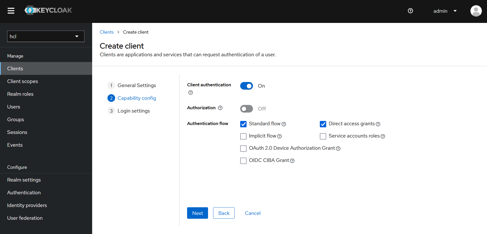

# Configure Keycloak as an OIDC IdP for HCL Connections

This document provides information around the configuration of Keycloak as an OIDC Identity Provider against HCL Connections as a relying party. The full configuration here entails setup of a realm, user federation, client, custom claims for client scopes and respective mappers to wire of those claims, and is explained in detail in the document linked above.

For the HCL DS Keycloak service the required settings/configuration already are in place and get rolled out during deployment. They should still be validated once before proceeding to ensure everything is understood and properly set up. Customers certainly can set up their own realm and client as needed using below steps, or adjust the once created by default.

If you are fine with the default configuration, feel free to skip the rest and continue to [Set up OIDC for HCL Connections](./cnx-integration.md).

First, log in to Keycloak at `https://<HOSTNAME>/auth/admin` with user `admin` and password `admin`. Then, select the realm `hcl` in the top left dropdown.

1. Login to the admin console and login: `https://<HOSTNAME>/auth/admin`

2. From the top left dropdown select Create Realm , add new realm name and click Create (e.g. hcl):

    

3. Go to the Clients Section and click Create Client, then add the following values and check the right boxes as shown below:

    - Client ID: hcl-cnx-oidc-client
    - Name: HCL Connections

      Click Next

    

    - Check the Client authentication option and click “Next”.

    

    - Enter the following Valid redirect URIs and click “Save”:

    ```sh
    https://<CNX_HOST>:<CNX_PORT>/oidcclient/keycloak
    https://<CNX_HOST>/homepage/login
    ```

    

4. Create client scope Mapper for realmName: Go to {realm} -> Client scope -> roles -> Add mappers -> By Configuration -> Hardcoded Claim

    - Fill in following fields with below values:

      - Name = realmName
      - Token Claim Name = realmName
      - Claim Value = {realm} (change this as per your realm)
      - Check Add to ID token
      - Check Add to access token
      - Check Add to userinfo
      - Click Save.

      

5. Add openid client scope (if not available), select Client Scopes -> Create Client

    - Name: openid
    - Click “Save”

      

6. Add openid client scope to client (if not added), select Clients -> hcl-cnx-oidc-client(client name) -> client scopes -> add client scope -> select openid -> Add as default.

### Update OIDC configuration for CNX Logout flow

1. For Logout add Front channel logout url in client configuration as below:

    ```sh
    https://<CNX_HOST>/connections/servlet-request-logout 
    ```
    
     

2. As Front channel logout url is browser specific, it also require to update Content-Security-Policy in realm setting.

    ```sh
    Realm Setting --> Security defenses--> Content-Security-Policy
    frame-src 'self' https://*.<DOMAIN>;  frame-ancestors 'self' https://*.<DOMAIN>;   object-src 'none';
    ```

<DOMAIN> could be `mycustomer.com`, for example.


## Integrate with HCL Connections

From here, check out the steps to [Set up OIDC for HCL Connections](./cnx-integration.md).