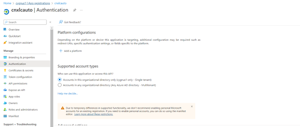

## Setting up workflow between Azure AD(IDP) and Keycloak(SP) using OIDC

On a high level, the following tasks will be executed to establish this configuration:

- Creating a Directory on Azure portal 
- Register a new Application inside Azure directory
- Configure registered application
- Configure keycloak realm and client
- Create Identity provider against keycloak realm
- Add redirect URI to azure application

    
## Creating a Directory on Azure portal
         
- Browse to the <a href='https://portal.azure.com/'>Azure portal</a> and sign in with an account that has an Azure subscription.
- Select the plus icon (+) and search for Azure Active Directory.

    

- Select Create

    

- Provide an Organization name and an Initial domain name. Then select Create. Your directory is created.

    

## Register a new Application inside Azure directory

- Select Azure Active Directory from menu
- Under Manage, select App registrations > New registration.

    

- Enter a display Name for your application. Users of your application might see the display name when they use the app, for example during sign-in. You can change the display name at any time and multiple app registrations can share the same name. The app registration's automatically generated Application (client) ID, not its display name, uniquely identifies your app within the identity platform.
- Specify who can use the application, sometimes called its sign-in audience.

    | Supported account types                              | Description                                                                                                                                                                                                                                                                                                                                                                                                                                                                                                                                                                                                                                                                                                                                                                                                                                                                                                                                                                                                                                                                                                                                                                                                                                                                                                                                                                                                                                                                                                   |
    | --------------------------------- | ------------------------------------------------------------------------------------------------------------------------------------------------------------------------------------------------------------------------------------------------------------------------------------------------------------------------------------------------------------------------------------------------------------------------------------------------------------------------------------------------------------------------------------------------------------------------------------------------------------------------------------------------------------------------------------------------------------------------------------------------------------------------------------------------------------------------------------------------------------------------------------------------------------------------------------------------------------------------------------------------------------------------------------------------------------------------------------------------------------------------------------------------------------------------------------------------------------------------------------------------------------------------------------------------------------------------------------------------------------------------------------------------------------------------------------------------------------------------------------------------------- |
    | Accounts in this organizational directory only             | Select this option if you're building an application for use only by users (or guests) in your tenant.          Often called a line-of-business (LOB) application, this app is a single-tenant application in the Microsoft identity platform.                                                                                                                                                                                                                                                                                                                                                                                                                                                                                                                                                                                                                                                                                                                                                                                                                                                                                                                                                                                                                                                                                                                                                                                                                                                                                                                                                                                                                                                                                      |
    | Accounts in any organizational directory               | Select this option if you want users in any Azure Active Directory (Azure AD) tenant to be able to use your application. This option is appropriate if, for example, you're building a software-as-a-service (SaaS) application that you intend to provide to multiple organizations. This type of app is known as a multitenant application in the Microsoft identity platform.                                                                                                                                                                                                                                                                                                                                                                                                                                                                                                                                                                                                                                                                                                                                                                                                                                                                                                                                                                                                                                                                                                                                                                                                                                                                                                                                                                                                                                                                                                   |
    | Accounts in any organizational directory and personal Microsoft accounts           | Select this option to target the widest set of customers. By selecting this option, you're registering a multitenant application that can also support users who have personal Microsoft accounts.                                                                                                                                                                                                                                                                                                                                                                                                                                                                                                                                                                                                                                                                                                                                                                                                                                                                                                                                                                                                                                                                                                                                                                                                                                                                                                                                                                                                                                                                    |
    | Personal Microsoft accounts     | Select this option if you're building an application only for users who have personal Microsoft accounts. Personal Microsoft accounts include Skype, Xbox, Live, and Hotmail accounts.                                                                                                                                                                                                                                                                                                                                                                                                                                                                                                                                                                                                                                                                                                                                                                                                                                                                                                                                                                                                                                                                                                                                                                                                                                                                                                                                                                                                                                                                                                   |

- Don't enter anything for Redirect URI (optional). You'll configure a redirect URI in the next section.
- Select Register to complete the initial app registration.

    

- When registration finishes, the Azure portal displays the app registration's Overview pane. You see the Application (client) ID. Also called the client ID, this value uniquely identifies your application in the Microsoft identity platform.
- Your application's code, or more typically an authentication library used in your application, also uses the client ID. The ID is used as part of validating the security tokens it receives from the identity platform.

    

## Configure registered application

- Add Client credentials

    - Credentials are used by <a href='https://learn.microsoft.com/en-us/azure/active-directory/develop/msal-client-applications'> confidential client applications </a> that access a web API. Examples of confidential clients are web apps, other web APIs, or service-type and daemon-type applications. Credentials allow your application to authenticate as itself, requiring no interaction from a user at runtime.
    - You can add both certificates and client secrets (a string) as credentials to your confidential client app registration.

        

- Add certificate

    Sometimes called a public key, a certificate is the recommended credential type because they're considered more secure than client secrets. For more information about using a certificate as an authentication method in your application, see <a href='https://learn.microsoft.com/en-us/azure/active-directory/develop/active-directory-certificate-credentials'> Microsoft identity platform application authentication certificate credentials. </a>

    - In the Azure portal, in App registrations, select your application.
    - Select Certificates & secrets -> Certificates -> Upload certificate.
    - Select the file you want to upload. It must be one of the following file types: .cer, .pem, .crt.
    - Select Add.

- Add client secret

    Sometimes called an application password, a client secret is a string value your app can use in place of a certificate to identity itself.

    Client secrets are considered less secure than certificate credentials. Application developers sometimes use client secrets during local app development because of their ease of use. 

    However, you should use certificate credentials for any of your applications that are running in production.

    - In the Azure portal, in App registrations, select your application.
    - Select Certificates & secrets -> Client secrets -> New client secret.
    - Add a description for your client secret.
    - Select an expiration for the secret or specify a custom lifetime.
        - Client secret lifetime is limited to two years (24 months) or less. You can't specify a custom lifetime longer than 24 months.
        - Microsoft recommends that you set an expiration value of less than 12 months.

    - Select Add.
    - Record the secret's value for use in your client application code. This secret value is never displayed again after you leave this page.
        
        

- Add federated credential

    Federated identity credentials are a type of credential that allows workloads, such as GitHub Actions, workloads running on Kubernetes, or workloads running in compute platforms outside of Azure access Azure AD protected resources without needing to manage secrets using <a href='https://learn.microsoft.com/en-us/azure/active-directory/develop/workload-identity-federation'> workload identity federation </a>

    To add a federated credential, follow these steps:

    - In the Azure portal, in App registrations, select your application.
    - Select Certificates & secrets > Federated credentials > Add a credential.
    - In the Federated credential scenario drop-down box, select one of the supported scenarios, and follow the corresponding guidance to complete the configuration.
        - Customer managed keys for encrypt data in your tenant using Azure Key Vault in another tenant.
        - GitHub actions deploying Azure resources to <a href='https://learn.microsoft.com/en-us/azure/active-directory/develop/workload-identity-federation-create-trust#github-actions'> configure a GitHub workflow </a> to get tokens for your application and deploy assets to Azure.
        - Kubernetes accessing Azure resources to configure a <a href='https://learn.microsoft.com/en-us/azure/active-directory/develop/workload-identity-federation-create-trust#kubernetes'> Kubernetes service account </a> to get tokens for your application and access Azure resources.
        - Other issuer to configure an identity managed by an external <a href='https://learn.microsoft.com/en-us/azure/active-directory/develop/workload-identity-federation-create-trust#other-identity-providers'> OpenID Connect provider </a> to get tokens for your application and access Azure resources.

## Configure keycloak realm and client

- Login to keycloak Server’s "Administrative Console"
- Once Logged in you will find  “Add Relam” button on LHS menu. Click the same.
- Provide your realm name & click create Button.
- Once Realm get created, go to “Clients” option in LHS menu & click “Client” option.
- Provide Client ID & Save the client by clicking “Save” button
- It will redirect you to client settings page.
- Change Access Type, Valid Redirect URL & Enable Session state option.
- After saving, new tab named ‘Credentials’ will appear.
- Secret key will be used while setting up client in WAS as
- Go to Mapper and click “Create” button to create new mapper
- Provide the required values and click save. (Client Value should same as your realm name)
- Client setup is complete.

## Create Identity provider against keycloak realm

- Login to keycloak server: https://&lt;KEYCLOAK_HOST&gt;/auth
- Select administrator control and select realm where we want to add IDP
- Click on Identity provider from LHS menu
- Select OpenID connect V1.0 from add provider list.
- Copy Endpoint URL from Azure portal
- Go to azure portal—select the app registered—click on Endpoint
- Copy the OpenID Connect metadata document url:

    

- Paste this url in keycloak as discovery endpoint, this will auto populate all required fields in IDP creation.

        

- Enter the client ID and client secrete copied from Azure portal.

    

- Click save

    

- Copy the redirect URL from this IDP: this redirect URL need to be added against the newly registered APP inside azure portal.

    

## Add redirect URI to azure application
    
A redirect URI is the location where the Microsoft identity platform redirects a user's client and sends security tokens after authentication.

To configure application settings based on the platform or device you're targeting, follow these steps:

- In the Azure portal, in App registrations, select your application.
- Under Manage, select Authentication.
- Under Platform configurations, select Add a platform.
- Under Configure platforms, select the tile for your application type (platform) to configure its settings.

    

- Paste /Enter the copied redirect url here:

    

- **Note:** Redirect_uri needs to set as defined under the client configuration where application needs to redirect after successful login. Otherwise it will throw an error saying invalid redirect_uri.
