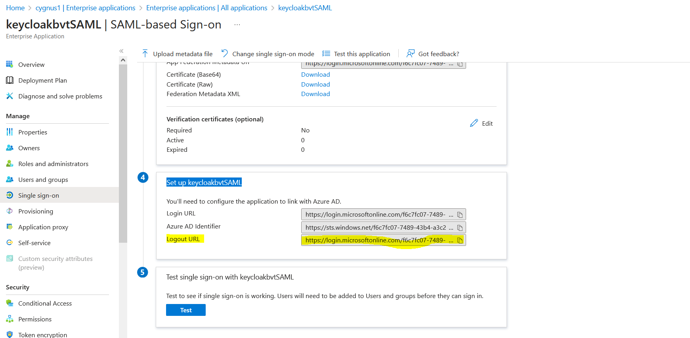

## Setting up workflow between Azure AD(IDP) and Keycloak(SP) using SAML

On a high level, the following tasks will be executed to establish this configuration:
 
- Creating a Directory on Azure portal 
- Create a new Application using the Azure portal
- Configure keycloak realm and client
- Create Identity provider against keycloak realm

    
## Creating a Directory on Azure portal
         
- Browse to the <a href='https://portal.azure.com/'>Azure portal</a> and sign in with an account that has an Azure subscription.
- Select the plus icon (+) and search for Azure Active Directory.

    

- Select Create

    

- Provide an Organization name and an Initial domain name. Then select Create. Your directory is created.

    

## <a href='https://learn.microsoft.com/en-us/azure/active-directory/manage-apps/add-application-portal'> Create a new Application using the Azure portal </a>

- Select Azure Active Directory from menu
- Under Manage, select Enterprise Application -> New Application

    

- Create your own application
- Enter Name of app , select Non-Gallery from options and click create

    

- Once application is created, select single sign on from overview page.

    

- Select sign on method as SAML
- Enter Identifier as your Realm URL that you have configured in Keycloak Server and Reply URL as your Endpoint  and Click Save. Those URLS are from your keycloak realm. For configuration of realm please see configuration of keycloak at bottom.

    

    

- Click Save
- From SAML certificate tab download the Federated Metadata XML. It will be used while creating provider in your keycloak server

    

- Select Assign users and groups if facing any issue while logging through azure. <a href='https://learn.microsoft.com/en-us/azure/active-directory/manage-apps/add-application-portal-assign-users'> Create and assign a user account </a>

    

- Add user/group

    

- Click on Users None selected

    

- Select the user
- Select and assign

    

## Configure keycloak realm and client

- Login to keycloak Server’s "Administrative Console"
- Once Logged in you will find  “Add Relam” button on LHS menu. Click the same.
- Provide your realm name & click create Button.
- Once Realm get created, go to “Clients” option in LHS menu & click “Client” option.
- Provide Client ID & Save the client by clicking “Save” button
- It will redirect you to client settings page.
- Change Access Type, Valid Redirect URL & Enable Session state option.
- After saving, new tab named ‘Credentials’ will appear.
- Secret key will be used while setting up client in WAS as
- Go to Mapper and click “Create” button to create new mapper
- Provide the required values and click save. (Client Value should same as your realm name)
- Client setup is complete.

## Create Identity provider against keycloak realm

- Login to keycloak server: https://&lt;KEYCLOAK_HOST&gt;/auth
- Select administrator control and select realm where we want to add IDP
- Click on Identity provider from LHS menu
- Select SAML v2.0 from add provider list.

    

- Upload the downloaded Metadata xml file from azure application under Import config from file section

    

- Once file successfully imported, this will auto populate all required fields in IDP creation.

    

- Add Single logout service URL in IDP configuration , to get this url logon to azure portl -> Enterprise application -> select application -> click on setup single sign on -> copy logout url from set up box

    
    
- Copy the redirect URL from this IDP: this redirect URL need to be added against the newly registered APP inside azure portal. For BASIC SAML Configuration

    

- Also copy the same rediret url as Logout URL in azure application

    

- IDP successfully created.

