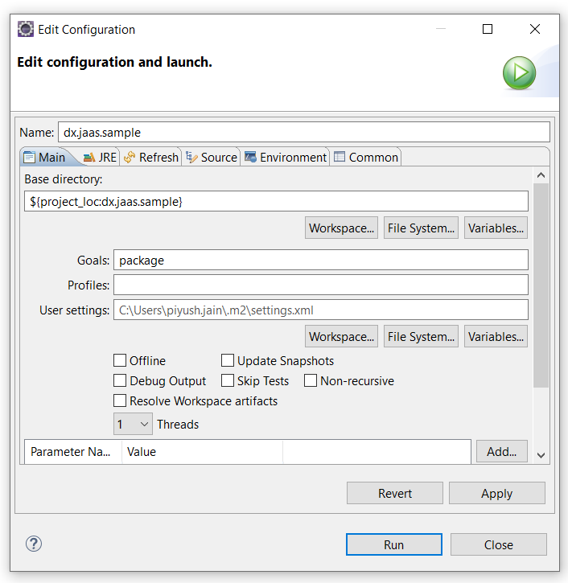

## Building and deploying custom JAAS login module
Here we will be using Maven and Eclipse to build the custom JAAS login module jar file.

> **_Note:_**
>
> Make sure that the following JAR files are available in the `lib` folder

    - com.ibm.ws.runtime.jar
    - com.ibm.ws.security.oidc.client.jar

    These JAR files can be found in the `app_server_root/plugins` folder on the server, for example `/opt/HCL/AppServer/plugins`

1. Open the Eclipse IDE and import the `dx.jaas.sample` folder from this repository

1. After making your changes, right-click on the `dx.jaas.sample` folder in Eclipse, then select Run as > Maven install

1. Next, go to Run as again and choose `Maven build...` Configure your build window with the following details:
    1. Add `package` as a Goal
    1. Check your JRE
    1. Click Run

    

1. Once it is complete you will get `dx.jaas.sample.jar` file in `dx.jaas.sample\target\dx.jaas.sample.jar` folder

1. Now copy the `dx.jaas.sample.jar` into the class path (e.g. `opt/HCL/lib/ext/` for traditional environments or `/opt/HCL/wp_profile/classes` for containerized environments).

    ```sh
    cp dx.jaas.sample.jar /opt/HCL/wp_profile/classes
    ```

1. Configure the global security settings in WAS ISC

    Navigate to **Global Security** > **JAAS - System Logins** > **WEB_INBOUND**.

    Use the class provided by your JAR file or use the default `TransientUsersLoginModule` class.

1. Ensure that the module order for **WEB_INBOUND** is set as follows

    | Module Class Name | Module Order |
    | --- | --- |
    | com.hcl.dx.auth.jaas.impl.TransientUsersLoginModule | 1 |
    | com.ibm.ws.security.server.lm.ltpaLoginModule | 2 |
    | com.ibm.ws.security.server.lm.wsMapDefaultInboundLoginModule | 3 |

1. Click **OK**, and **Save** to the master configuration

1. Restart the server